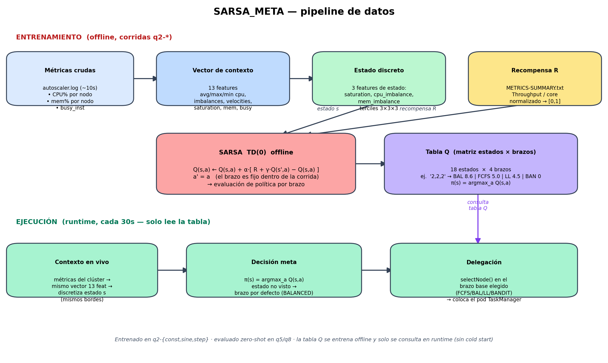
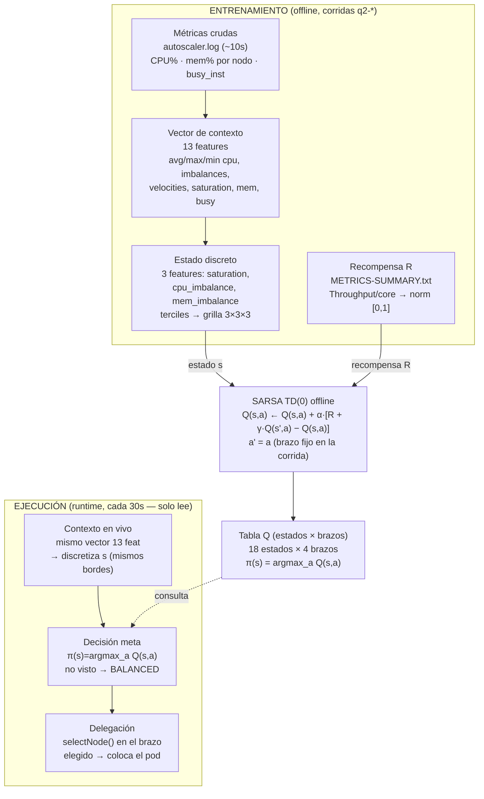

# SARSA_META — meta-scheduler tabular basado en SARSA

Meta-scheduler que **elige qué estrategia base de scheduling usar** (FCFS / BALANCED /
LEAST_LOADED / BANDIT) según el estado del clúster. SARSA actúa como **meta-optimizador**
(no como un brazo): la tabla Q se entrena **offline** y en ejecución solo se consulta
(sin *cold start*).

## Diagrama del pipeline

## Cómo se construye el estado

1. **Métricas crudas → 13 features.** De cada snapshot (CPU%/mem% por nodo, `busy_inst`)
   se calcula un vector continuo de 13 features (avg/max/min cpu, `cpu_imbalance`,
   `cpu_velocity`, `avg_mem`, `mem_imbalance`, `mem_velocity`, `saturation`, `busy_inst`,
   `busy_velocity`, `elapsed_norm`, bias).
2. **Subconjunto de estado (3 features):** `saturation`, `cpu_imbalance`, `mem_imbalance`.
   Solo 3 para evitar la maldición de la dimensionalidad (3¹³ ≈ 1.6M estados vs 3³ = 27).
3. **Discretización por terciles** (bordes = cuantiles 1/3 y 2/3 de los datos de
   entrenamiento, guardados en el JSON). Bordes reales del modelo:
   | feature | bordes | bins |
   |---|---|---|
   | saturation | [0.05, 0.075] | LOW / MED / HIGH |
   | cpu_imbalance | [0.03, 0.05] | LOW / MED / HIGH |
   | mem_imbalance | [0.13, 0.14] | LOW / MED / HIGH |
4. **Clave de estado** = concatenación de los 3 bins, ej. `"2,1,0"`. La tabla Q es la
   matriz `estados × brazos`.

## Métricas de entrenamiento

| Rol | Fuente | Uso |
|---|---|---|
| **Contexto** (→ estado) | `autoscaler.log` (snapshots ~10s): CPU%/mem% por nodo, `busy_inst`, timestamp | Construye las 13 features → estado discreto |
| **Recompensa** (señal a maximizar) | `METRICS-SUMMARY.txt`: `Throughput / core` | Normalizada a [0,1]; es la R que SARSA propaga con TD |

- **Entrenamiento:** `q2-{const,sine,step}` × {FCFS, BALANCED, LEAST_LOADED, BANDIT}.
- **Evaluación:** q5 / q8 (zero-shot).

## Por qué SARSA funciona como meta (sin cold start)

Cada corrida histórica usó **un solo brazo** de principio a fin → es una trayectoria
on-policy donde la acción siguiente `a'` es siempre igual a `a`. Eso hace que el update
SARSA sea una **evaluación de política limpia** del comportamiento "comprometerse con el
brazo `a`". La tabla se entrena offline y en runtime solo se consulta → no hay cold start
(a diferencia de SARSA-como-brazo, que falló por eso).

## Resultado clave

En **Q8/sine** (join stateful + alta varianza) SARSA_META **gana** (1.876 ev/s/core, +25%
sobre el siguiente) y resuelve la anomalía Q8. Generaliza zero-shot, no colapsa a constante
(8–9 switches en sine), y no domina en Q5 (más CPU-bound) — su valor se concentra en el
régimen stateful de alta varianza.

---
Fuente: `scheduler/.../strategy/SarsaMetaStrategy.java`, `scripts/train_sarsa_meta.py`,
`scripts/draw_sarsa_pipeline.py`.
